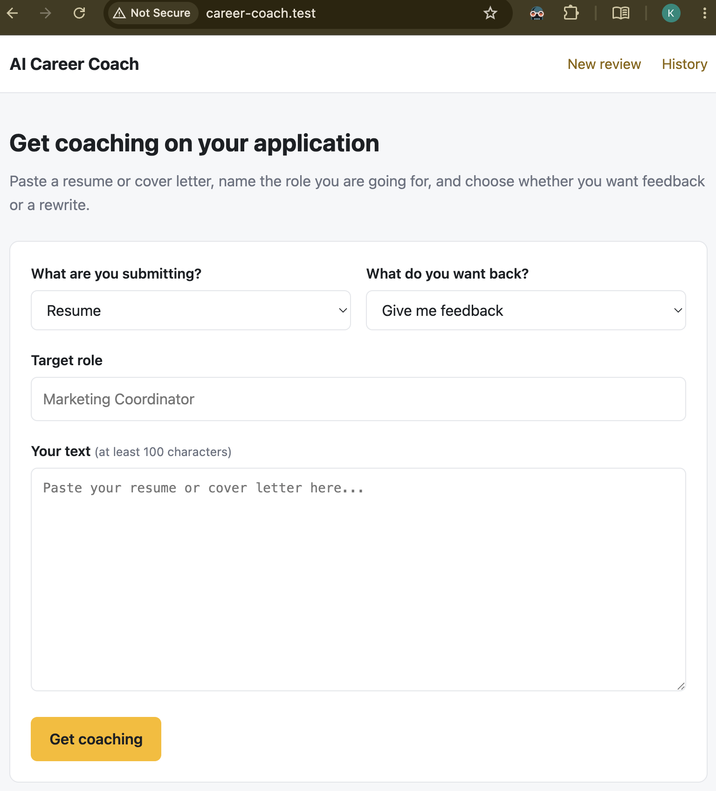
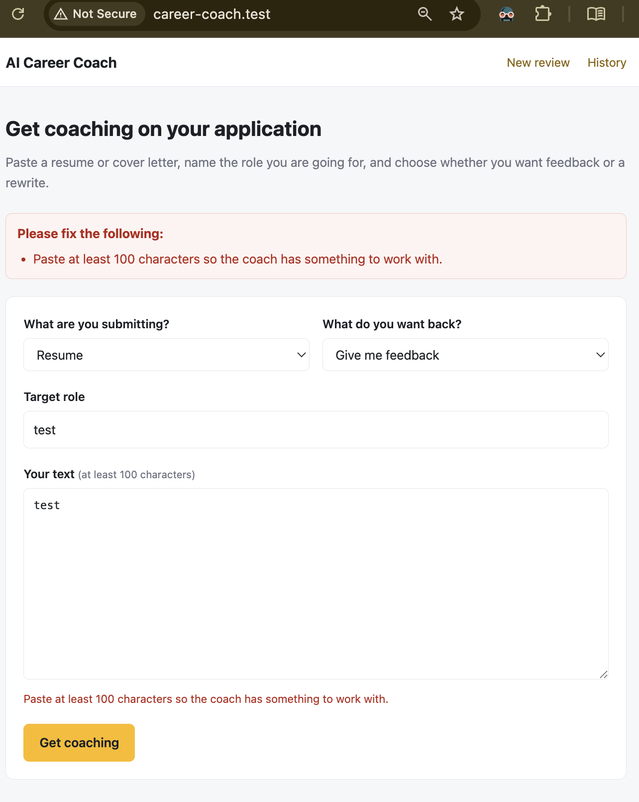
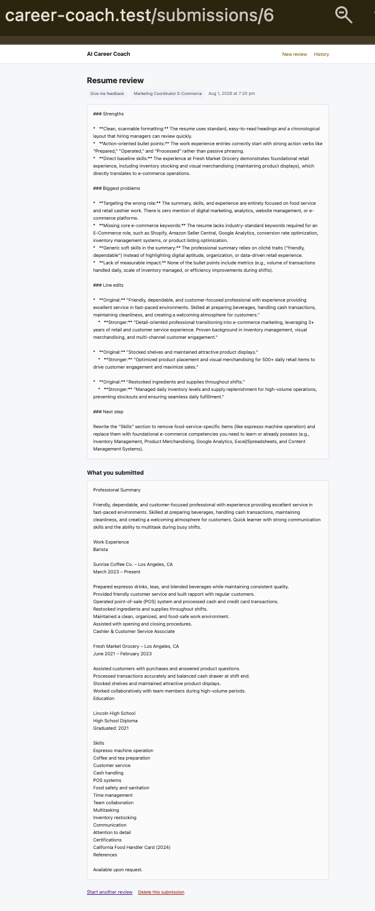
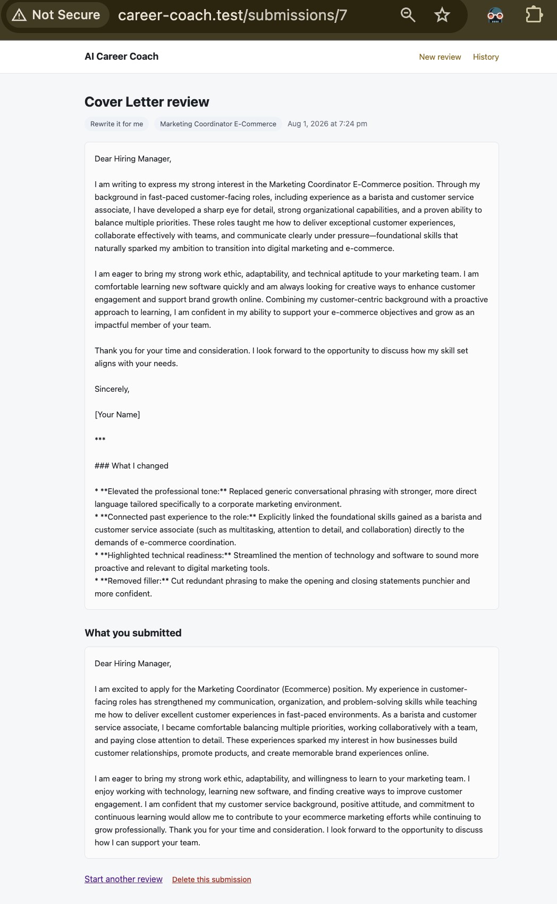
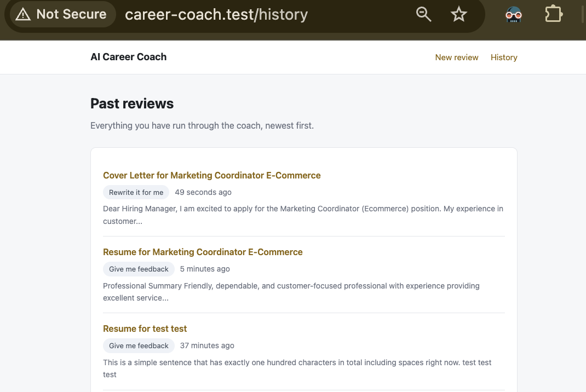

# Final Project: AI Career Coach

**GitHub Repo:** https://github.com/keani-julian/cs85-finalProject

## Project description: 
Final project Laravel web application that reviews job application documents using Google's Gemini API. Paste a resume or cover letter, name the role you are targeting, and the AI coach either returns structured feedback or rewrites the document for you based on your selection. Every submission is saved to MySQL so you can revisit past reviews.

## Features

- **Two coaching modes** — request structured feedback (Strengths, Biggest problems, Line edits, Next step) or a full rewrite of the document.
- **Role-targeted advice** — the AI tailors its response to the job title you enter rather than giving generic tips.
- **Anti-fabrication prompting** — the AI is instructed never to invent employers, dates, degrees, or metrics. Where a rewrite would need detail that is not in the original, it inserts `[ADD DETAIL]` for the user to fill in.
- **Form validation** — server-side rules on all four fields with plain-English error messages, and old input is preserved when validation fails.
- **Error handling** — API failures are logged with status and response body, then surfaced to the user as a readable message instead of a stack trace. Rate limiting (HTTP 429) gets its own message.
- **Submission history** — every review is stored in MySQL, listed newest-first with pagination, and individually viewable or deletable.

## Setup instructions

### Requirements

- PHP 8.5+
- Composer
- MySQL
- A Gemini API key (free, no credit card) from [aistudio.google.com/app/apikey](https://aistudio.google.com/app/apikey)

### Steps

1. **Clone the repository**

   ```bash
   git clone https://github.com/keani-julian/cs85-finalProject.git
   cd cs85-finalProject
   ```

2. **Install dependencies**

   ```bash
   composer install
   ```

3. **Create your environment file**

   ```bash
   cp .env.example .env
   php artisan key:generate
   ```

4. **Create the database**

   ```bash
   mysql -u root -p -e "CREATE DATABASE career_coach CHARACTER SET utf8mb4 COLLATE utf8mb4_unicode_ci;"
   ```

5. **Configure `.env`**

   Set your database credentials and paste your Gemini API key:

   ```
   DB_DATABASE=career_coach
   DB_USERNAME=root
   DB_PASSWORD=your_password

   GEMINI_API_KEY=your_gemini_api_key
   ```

6. **Run the migrations**

   ```bash
   php artisan migrate
   ```

7. **Serve the app**

   With Laravel Herd:

   ```bash
   herd link career-coach
   ```

   Then visit `http://career-coach.test`. Without Herd, run `php artisan serve` and visit `http://127.0.0.1:8000`.


## Screenshots

### Submission form


### Validation errors


### AI feedback result


### AI rewrite result


### Submission history


